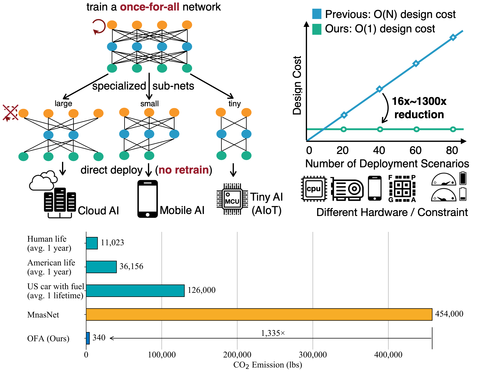
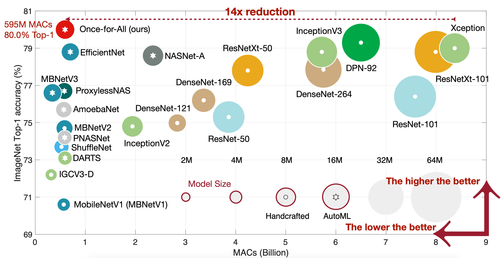
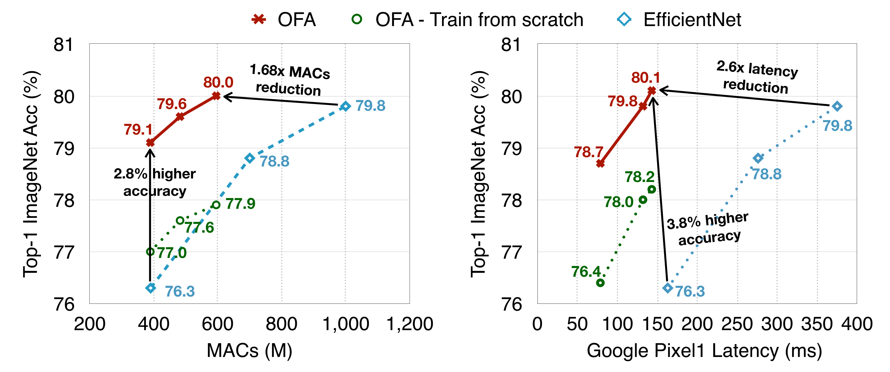
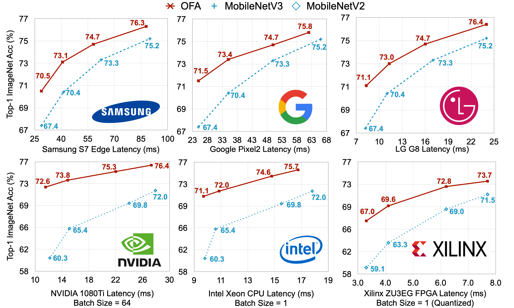
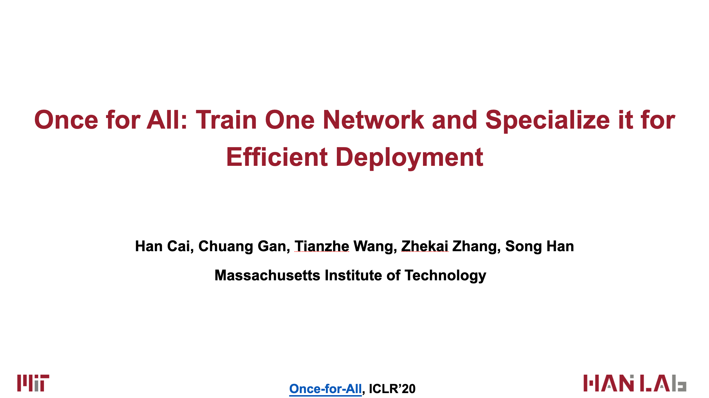
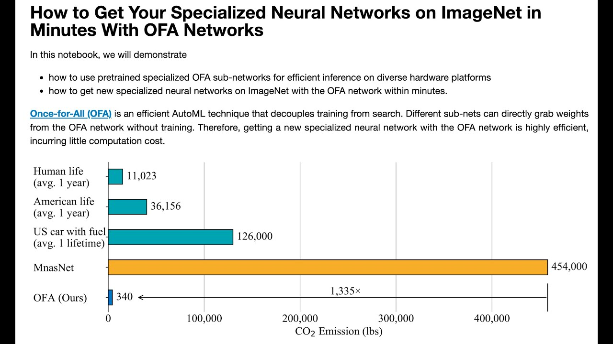

# Once for All: Train One Network and Specialize it for Efficient Deployment [[arXiv]](https://arxiv.org/abs/1908.09791) [[Slides]](https://file.lzhu.me/projects/OnceForAll/OFA%20Slides.pdf) [[Video]](https://youtu.be/a_OeT8MXzWI)
```BibTex
@inproceedings{
  cai2020once,
  title={Once for All: Train One Network and Specialize it for Efficient Deployment},
  author={Han Cai and Chuang Gan and Tianzhe Wang and Zhekai Zhang and Song Han},
  booktitle={International Conference on Learning Representations},
  year={2020},
  url={https://arxiv.org/pdf/1908.09791.pdf}
}
```

**[News]** First place in the [CVPR 2020 Low-Power Computer Vision Challenge](https://lpcv.ai/2020CVPR/introduction), CPU detection and FPGA track.

**[News]** OFA-ResNet50 is released. 

**[News]** The [hands-on tutorial](https://hangzhang.org/CVPR2020/) of OFA is released! [](https://colab.research.google.com/github/mit-han-lab/once-for-all/blob/master/tutorial/ofa.ipynb)

**[News]** OFA is available via pip! Run **```pip install ofa```** to install the whole OFA codebase. 

**[News]** First place in the 4th [Low-Power Computer Vision Challenge](https://lpcv.ai/competitions/2019), both classification and detection track.

**[News]** First place in the 3rd [Low-Power Computer Vision Challenge](https://lpcv.ai/competitions/2019), DSP track at ICCV’19 using the Once-for-all Network.

## Train once, specialize for many deployment scenarios


## 80% top1 ImageNet accuracy under mobile setting




## Consistently outperforms MobileNetV3 on Diverse hardware platforms


## OFA-ResNet50 [[How to use]](https://github.com/mit-han-lab/once-for-all/blob/master/tutorial/ofa_resnet50_example.ipynb)


## How to use / evaluate **OFA Networks**
### Use
```python
""" OFA Networks.
    Example: ofa_network = ofa_net('ofa_mbv3_d234_e346_k357_w1.0', pretrained=True)
""" 
from ofa.model_zoo import ofa_net
ofa_network = ofa_net(net_id, pretrained=True)
    
# Randomly sample sub-networks from OFA network
ofa_network.sample_active_subnet()
random_subnet = ofa_network.get_active_subnet(preserve_weight=True)
    
# Manually set the sub-network
ofa_network.set_active_subnet(ks=7, e=6, d=4)
manual_subnet = ofa_network.get_active_subnet(preserve_weight=True)
```
If the above scripts failed to download, you download it manually from [Google Drive](https://drive.google.com/drive/folders/10leLmIiMtaRu4J46KwrBaMydvQt0qFuI?usp=sharing) and put them under $HOME/.torch/ofa_nets/.

### Evaluate

`python eval_ofa_net.py --path 'Your path to imagenet' --net ofa_mbv3_d234_e346_k357_w1.0 `

| OFA Network         | Design Space | Resolution | Width Multiplier |  Depth |  Expand Ratio |  kernel Size | 
|----------------------|:----------:|:----------:|:---------:|:------------:|:---------:|:------------:|
| ofa_resnet50 | ResNet50D | 128 - 224 | 0.65, 0.8, 1.0 | 0, 1, 2 | 0.2, 0.25, 0.35 | 3 |
| ofa_mbv3_d234_e346_k357_w1.0 | MobileNetV3 | 128 - 224 | 1.0 | 2, 3, 4 | 3, 4, 6 | 3, 5, 7 |
| ofa_mbv3_d234_e346_k357_w1.2 | MobileNetV3 | 160 - 224 | 1.2 | 2, 3, 4 | 3, 4, 6 | 3, 5, 7 |
| ofa_proxyless_d234_e346_k357_w1.3 | ProxylessNAS | 128 - 224 | 1.3 | 2, 3, 4 | 3, 4, 6 | 3, 5, 7 |

## How to use / evaluate **OFA Specialized Networks** 
### Use
```python
""" OFA Specialized Networks.
Example: net, image_size = ofa_specialized('flops@595M_top1@80.0_finetune@75', pretrained=True)
""" 
from ofa.model_zoo import ofa_specialized
net, image_size = ofa_specialized(net_id, pretrained=True)
```
If the above scripts failed to download, you download it manually from [Google Drive](https://drive.google.com/drive/folders/1ez-t_DAHDet2fqe9TZUTJmvrU-AwofAt?usp=sharing) and put them under $HOME/.torch/ofa_specialized/.

### Evaluate

`python eval_specialized_net.py --path 'Your path to imagent' --net flops@595M_top1@80.0_finetune@75 `


| OFA Specialized Sub-nets                   | Top-1 (%)    | Top-5 (%)    | #Params |  #MACs | 
|----------------------|:----------:|:----------:|:---------:|:------------:| 
|   **ResNet50 Design Space** |
| resnet50D_MAC@4.1B_top1@79.8 | 79.8 | 94.7 | 30.9M | 4.1B |
| resnet50D_MAC@3.7B_top1@79.7 | 79.7 | 94.7 | 26.5M | 3.7B |
| resnet50D_MAC@3.0B_top1@79.3 | 79.3 | 94.5 | 28.7M | 3.0B |
| resnet50D_MAC@2.4B_top1@79.0 | 79.0 | 94.2 | 29.0M | 2.4B |
| resnet50D_MAC@1.8B_top1@78.3 | 78.3 | 94.0 | 20.7M | 1.8B |
| resnet50D_MAC@1.2B_top1@77.1_finetune@25 | 77.1 | 93.3 | 19.3M | 1.2B |
| resnet50D_MAC@0.9B_top1@76.3_finetune@25 | 76.3 | 92.9 | 14.5M | 0.9B |
| resnet50D_MAC@0.6B_top1@75.0_finetune@25 | 75.0 | 92.1 | 9.6M | 0.6B |
|   **FLOPs** |
| [flops@595M_top1@80.0_finetune@75](https://drive.google.com/file/d/1924Ta7J0xPKRef3Psa9X11C8BX872IOB/view?usp=sharing)          | 80.0     | 94.9     | 9.1M   | 595M |
| [flops@482M_top1@79.6_finetune@75](https://drive.google.com/file/d/1IQLcolMQsctWbjcqk14CUMCV2HbIpuf7/view?usp=sharing)          | 79.6     | 94.8     | 9.1M   | 482M |
| [flops@389M_top1@79.1_finetune@75](https://drive.google.com/file/d/1kmMj5ouaoij4atTcU8l6iOaAQW6gwsFX/view?usp=sharing)          | 79.1     | 94.5     | 8.4M   | 389M |
|  **LG G8** |
| [LG-G8_lat@24ms_top1@76.4_finetune@25](https://drive.google.com/file/d/1IK1TE-79aUbjfQz047XbU8nfXZvLGgQs/view?usp=sharing)      | 76.4     | 93.0     | 5.8M   | 230M |
| [LG-G8_lat@16ms_top1@74.7_finetune@25](https://drive.google.com/file/d/1D4zzNZDQY_KMX7dH1wwlbFWFVQ_ibEXp/view?usp=sharing)      | 74.7     | 92.0     | 5.8M   | 151M |
| [LG-G8_lat@11ms_top1@73.0_finetune@25](https://drive.google.com/file/d/1g6nUehJ48vBqX19GorqJLh-wg6wjH9Hp/view?usp=sharing)      | 73.0     | 91.1     | 5.0M   | 103M |
| [LG-G8_lat@8ms_top1@71.1_finetune@25](https://drive.google.com/file/d/1T6YAdRQsFzlDMOsZReZ7TFd-HlmJ3K0i/view?usp=sharing)       | 71.1     | 89.7     | 4.1M   | 74M  |
|  **Samsung S7 Edge** |
| [s7edge_lat@88ms_top1@76.3_finetune@25](https://drive.google.com/file/d/1u_N1zsJY1ZjjrDfOKz6l6IfEQHS0W0VM/view?usp=sharing)     | 76.3     | 92.9     | 6.4M   | 219M |
| [s7edge_lat@58ms_top1@74.7_finetune@25](https://drive.google.com/file/d/1PsrxebWQ3fxyQjPU-NgIV5xcj-_T808H/view?usp=sharing)     | 74.7     | 92.0     | 4.6M   | 145M |
| [s7edge_lat@41ms_top1@73.1_finetune@25](https://drive.google.com/file/d/1ETdfEKlf_tdtW534npXplzcm85bp9KYF/view?usp=sharing)     | 73.1     | 91.0     | 4.7M   | 96M |
| [s7edge_lat@29ms_top1@70.5_finetune@25](https://drive.google.com/file/d/1EiIByUAG-KIgcBaqHVAcLZGr_TRbpspo/view?usp=sharing)     | 70.5     | 89.5     | 3.8M   | 66M  |
|  **Samsung Note8** |
| [note8_lat@65ms_top1@76.1_finetune@25](https://drive.google.com/file/d/1UZ6NawJqyI2cWTuX6khM47wg4Gx4xCtV/view?usp=sharing)      | 76.1     | 92.7     | 5.3M   | 220M |
| [note8_lat@49ms_top1@74.9_finetune@25](https://drive.google.com/file/d/11GyU7_AwLaGrNgGMoPIgavJ42u43jg8R/view?usp=sharing)      | 74.9     | 92.1     | 6.0M   | 164M |
| [note8_lat@31ms_top1@72.8_finetune@25](https://drive.google.com/file/d/1b-gZlGtZ88eETXfIE7OwjSLCao6AgGIx/view?usp=sharing)      | 72.8     | 90.8     | 4.6M   | 101M |
| [note8_lat@22ms_top1@70.4_finetune@25](https://drive.google.com/file/d/1mOwp6uAuAInIDqXOCru2ilEtmv7LOEj9/view?usp=sharing)      | 70.4     | 89.3     | 4.3M   | 67M  |
|  **Samsung Note10** |
| [note10_lat@64ms_top1@80.2_finetune@75](https://drive.google.com/file/d/1Fniw7auRPYwn3LXkheb0jtVbz8P5zwzp/view?usp=sharing)     | 80.2     | 95.1     | 9.1M   | 743M |
| [note10_lat@50ms_top1@79.7_finetune@75](https://drive.google.com/file/d/1xFVQaOV2-jdHzT8YI_lG3wMLjpWoS-nV/view?usp=sharing)     | 79.7     | 94.9     | 9.1M   | 554M |
| [note10_lat@41ms_top1@79.3_finetune@75](https://drive.google.com/file/d/1Dg_MK2WE6iE4jYBlzN_2SOmaA2i1sGo5/view?usp=sharing)     | 79.3     | 94.5     | 9.0M   | 457M |
| [note10_lat@30ms_top1@78.4_finetune@75](https://drive.google.com/file/d/1I31s1iYJsxh8eBPnpC9k4WyQwrvJvVN0/view?usp=sharing)     | 78.4     | 94.2     | 7.5M   | 339M |
| [note10_lat@22ms_top1@76.6_finetune@25](https://drive.google.com/file/d/1t2tf-y_OWZvBr-3nPx-PB7qasz-l5TrU/view?usp=sharing)     | 76.6     | 93.1     | 5.9M   | 237M |
| [note10_lat@16ms_top1@75.5_finetune@25](https://drive.google.com/file/d/1xgkW4he1midlvdCtWugL2VIg4TNLxa-l/view?usp=sharing)     | 75.5     | 92.3     | 4.9M   | 163M |
| [note10_lat@11ms_top1@73.6_finetune@25](https://drive.google.com/file/d/1mxvU0NSNFmfpxSuqcGhv5u_UbWh_ohqx/view?usp=sharing)     | 73.6     | 91.2     | 4.3M   | 110M |
| [note10_lat@8ms_top1@71.4_finetune@25](https://drive.google.com/file/d/1f8cmdR3-4hMXrEpf3oYecKrTJbTR4B3P/view?usp=sharing)      | 71.4     | 89.8     | 3.8M   | 79M  |
|  **Google Pixel1** |
| [pixel1_lat@143ms_top1@80.1_finetune@75](https://drive.google.com/file/d/1I70UqBDJRbjwW5-q4bMAp-kUJwEAvnef/view?usp=sharing)     | 80.1     | 95.0     | 9.2M   | 642M |
| [pixel1_lat@132ms_top1@79.8_finetune@75](https://drive.google.com/file/d/1mhtTGOJCkwF5n0bOluSdGeIDtCqoLd7l/view?usp=sharing)     | 79.8     | 94.9     | 9.2M   | 593M |
| [pixel1_lat@79ms_top1@78.7_finetune@75](https://drive.google.com/file/d/1DHwA4JWPPT3XplT4yUrVXmtx-JBzjRG6/view?usp=sharing)     | 78.7     | 94.2     | 8.2M   | 356M |
| [pixel1_lat@58ms_top1@76.9_finetune@75](https://drive.google.com/file/d/1yjO7JoXv8lj1_igPP1gkwfXSMXyKEnim/view?usp=sharing)     | 76.9     | 93.3     | 5.8M   | 230M |
| [pixel1_lat@40ms_top1@74.9_finetune@25](https://drive.google.com/file/d/1slT_GD7SeLTy2p7OPAHvc0NXpmTEkjNW/view?usp=sharing)     | 74.9     | 92.1     | 6.0M   | 162M |
| [pixel1_lat@28ms_top1@73.3_finetune@25](https://drive.google.com/file/d/1D5gwpF9UA31Bcz53DLQII1sCMLJZ_Ky4/view?usp=sharing)     | 73.3     | 91.0     | 5.2M   | 109M |
| [pixel1_lat@20ms_top1@71.4_finetune@25](https://drive.google.com/file/d/1sm5vBxjapw_wWrO8NFwiiCTZHCqZfVMx/view?usp=sharing)     | 71.4     | 89.8     | 4.3M   | 77M |
|  **Google Pixel2** |
| [pixel2_lat@62ms_top1@75.8_finetune@25](https://drive.google.com/file/d/1FexSgoOJ_tar1fXcyxbTr4ZNH564bYFh/view?usp=sharing)      | 75.8     | 92.7     | 5.8M   | 208M |
| [pixel2_lat@50ms_top1@74.7_finetune@25](https://drive.google.com/file/d/1TfDCZFGzlzQ65r3GhA0GIdVD49-hWKtZ/view?usp=sharing)      | 74.7     | 91.9     | 4.7M   | 166M |
| [pixel2_lat@35ms_top1@73.4_finetune@25](https://drive.google.com/file/d/1e4J0p4BlRI34lvo9K7JG5aCuWoLhGUbg/view?usp=sharing)      | 73.4     | 91.1     | 5.1M   | 113M |
| [pixel2_lat@25ms_top1@71.5_finetune@25](https://drive.google.com/file/d/1BWZY1UvvqPKIZmbHRgItWPcFwOs8Ke1_/view?usp=sharing)      | 71.5     | 90.1     | 4.1M   | 79M  |
|  **1080ti GPU (Batch Size 64)** |
| [1080ti_gpu64@27ms_top1@76.4_finetune@25](https://drive.google.com/file/d/1_bxtAmBYVy-2joF2od_D1AXkHiGLav8y/view?usp=sharing)      | 76.4     | 93.0     | 6.5M   | 397M |
| [1080ti_gpu64@22ms_top1@75.3_finetune@25](https://drive.google.com/file/d/16BvFoiJKwcXybp_LHK_2zvbykvVGmbL7/view?usp=sharing)      | 75.3     | 92.4     | 5.2M   | 313M |
| [1080ti_gpu64@15ms_top1@73.8_finetune@25](https://drive.google.com/file/d/1mBgNJ8TEEr0gc4Zd5AXPx3swHgLxun9J/view?usp=sharing)      | 73.8     | 91.3     | 6.0M   | 226M |
| [1080ti_gpu64@12ms_top1@72.6_finetune@25](https://drive.google.com/file/d/1QdiyXZ9HIxi_f3snpJNNQ5mvd8Wei2WN/view?usp=sharing)      | 72.6     | 90.9     | 5.9M   | 165M  |
|  **V100 GPU (Batch Size 64)** |
| [v100_gpu64@11ms_top1@76.1_finetune@25](https://drive.google.com/file/d/1KOuj9Coyl8wTO-YzOtk3Ld-upo_UrIJD/view?usp=sharing)      | 76.1     | 92.7     | 6.2M   | 352M |
| [v100_gpu64@9ms_top1@75.3_finetune@25](https://drive.google.com/file/d/1fUHJ0Ad-h0ReJpV8zvt4uoa4Kzp1Q2U1/view?usp=sharing)      | 75.3     | 92.4     | 5.2M   | 313M |
| [v100_gpu64@6ms_top1@73.0_finetune@25](https://drive.google.com/file/d/1XhaH_8XUFzHwR1rNQ4bMaVC86DvMq6xj/view?usp=sharing)      | 73.0     | 91.1     | 4.9M   | 179M |
| [v100_gpu64@5ms_top1@71.6_finetune@25](https://drive.google.com/file/d/1vTg7s5xd5vAcDHZu_eUNHkI8aFauIerU/view?usp=sharing)      | 71.6     | 90.3     | 5.2M   | 141M  |
|  **Jetson TX2 GPU (Batch Size 16)** |
| [tx2_gpu16@96ms_top1@75.8_finetune@25](https://drive.google.com/file/d/1oQoFNDZhTIreAInVGFKtiYX_CiAJmCZa/view?usp=sharing)      | 75.8     | 92.7     | 6.2M   | 349M |
| [tx2_gpu16@80ms_top1@75.4_finetune@25](https://drive.google.com/file/d/19lbh5U9s4l6KqxcQ2MnnQZZjMMdjz63c/view?usp=sharing)      | 75.4     | 92.4     | 5.2M   | 313M |
| [tx2_gpu16@47ms_top1@72.9_finetune@25](https://drive.google.com/file/d/1dqa14vskudMKF5MZtivdfgGDgztsLEFA/view?usp=sharing)      | 72.9     | 91.1     | 4.9M   | 179M |
| [tx2_gpu16@35ms_top1@70.3_finetune@25](https://drive.google.com/file/d/1HRnVmY0khszffEsv8ZtJlTaOcixzz9C4/view?usp=sharing)      | 70.3     | 89.4     | 4.3M   | 121M  |
|  **Intel Xeon CPU with MKL-DNN (Batch Size 1)** |
| [cpu_lat@17ms_top1@75.7_finetune@25](https://drive.google.com/file/d/1eeGWBIj-3CPGlG_ZQGCmz7s1NinXM3Vu/view?usp=sharing)      | 75.7     | 92.6     | 4.9M   | 365M |
| [cpu_lat@15ms_top1@74.6_finetune@25](https://drive.google.com/file/d/1YFL86KdUZbP9gJi9k_pzct3Fl_v-uG0Q/view?usp=sharing)      | 74.6     | 92.0     | 4.9M   | 301M |
| [cpu_lat@11ms_top1@72.0_finetune@25](https://drive.google.com/file/d/16cxbfpv9Z7V8-3ZBTjkufEVfIEb_GcDI/view?usp=sharing)      | 72.0     | 90.4     | 4.4M   | 160M |
| [cpu_lat@10ms_top1@71.1_finetune@25](https://drive.google.com/file/d/1_WFv_Ty105BBHsVDRJRL3idZJzHScv-4/view?usp=sharing)      | 71.1     | 89.9     | 4.2M   | 143M  |

## How to train **OFA Networks**
```bash
mpirun -np 32 -H <server1_ip>:8,<server2_ip>:8,<server3_ip>:8,<server4_ip>:8 \
    -bind-to none -map-by slot \
    -x NCCL_DEBUG=INFO -x LD_LIBRARY_PATH -x PATH \
    python train_ofa_net.py
```
or 
```bash
horovodrun -np 32 -H <server1_ip>:8,<server2_ip>:8,<server3_ip>:8,<server4_ip>:8 \
    python train_ofa_net.py
```

## Introduction Video

[](https://www.youtube.com/watch?v=a_OeT8MXzWI&feature=youtu.be)

## Hands-on Tutorial Video

[](https://www.youtube.com/watch?v=wrsid5tvuSM)


## Requirement
* Python 3.6+
* Pytorch 1.4.0+
* ImageNet Dataset 
* Horovod

## Related work on automated and efficient deep learning:
[ProxylessNAS: Direct Neural Architecture Search on Target Task and Hardware](https://arxiv.org/pdf/1812.00332.pdf) (ICLR’19)

[AutoML for Architecting Efficient and Specialized Neural Networks](https://ieeexplore.ieee.org/abstract/document/8897011) (IEEE Micro)

[AMC: AutoML for Model Compression and Acceleration on Mobile Devices](https://arxiv.org/pdf/1802.03494.pdf) (ECCV’18)

[HAQ: Hardware-Aware Automated Quantization](https://arxiv.org/pdf/1811.08886.pdf)  (CVPR’19, oral)
